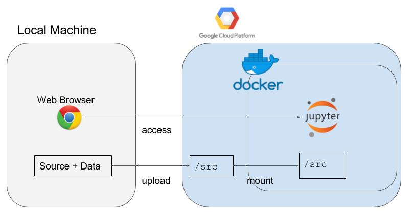

# Google Cloud Deep Learning Kit

This repository aims to create a GPU instance with Jupyter, Tensorflow and Keras on google cloud platform in an instant.



## Requirements

- make
- Google Cloud SDK
- Docker

## Life Cycle to Use this Kit

1. Create an instance with `make create-instance`
2. Run jupyter on the instance with `make run-jupyter`
  - It may takes 5 minutes or so.
3. Install python libraries with `make pip-install`
  - Put libraries you want to install in `./requirements.txt`
4. Upload files to the instance with `make upload-files`.
5. Make ssh tunnel to the instance with `make ssh-tunnel`
6. Access jupyter via your web browser
  - Default: `http://localhost:18888`
7. Download outputs with `make download-outputs`
8. Delete the instance with `make delete-instance`

## Installed python libraries in the docker image

The pre-built docker image on Docker Hub is created with the following anaconda environment YAML.
Don't worry, you can additionally install other python library with `make pip-install`, if you want.

[Anaconda Environment YAML](./docker/environment-gpu.yml)

## Commands Reference

### Create a GCP instance with GPU

It may take 5 minutes or so to finish to execute the startup script to install the require environment in your instance.

```
make create-instance \
  INSTANCE_NAME="test-gpu-instance" \
  GCP_PROJECT_ID=xxx-xxx-xxx
```

### Run Jupyter as a docker container

```
make run-jupyter \
  INSTANCE_NAME="test-gpu-instance" \
  GCP_PROJECT_ID=xxx-xxx-xxx
```

### SSH tunnel

In order to access the jupyter which you launched, you have to have a SSH tunnel.
When you got it, you can access `http://localhost:18888` via a web browser on your local machine.
When you don't set any value with `make ssh-tunnel`, the port is the default value.
The default of `JUPYTER_PORT` is `18888`.

```
make ssh-tunnel \
  INSTANCE_NAME="test-gpu-instance" \
  GCP_PROJECT_ID=xxx-xxx-xxx \
  JUPYTER_PORT=18888
```

### Delete the instance you created

The command is used for deleting the GCP instance you created.
Please don't forget to do that after you finish your works!

```
make delete-instance \
  INSTANCE_NAME="test-gpu-instance" \
  GCP_PROJECT_ID=xxx-xxx-xxx
```

### Install python libraries

If you want to install python libraries other than pre-installed ones, please add them to `./requirements.txt` and then execute the below command:

```
make pip-install \
  INSTANCE_NAME="test-gpu-instance" \
  GCP_PROJECT_ID=xxx-xxx-xxx
```

### Upload your files

This command allows us to upload files on a local machine to the instance.
Those files will be set at `/src` on the GCP machine and the docker container will mount it at `/src`.

```
make upload-files \
  INSTANCE_NAME="test-gpu-instance" \
  GCP_PROJECT_ID=xxx-xxx-xxx \
  FROM=/path/to/your/files
```

### Download ouputs

This command allows us to download files under `/src/outputs` in the instance.
When you save trained models and some predicted results under `/src/outputs`, you can download them with it.

```
make download-outputs \
  INSTANCE_NAME="test-gpu-instance" \
  GCP_PROJECT_ID=xxx-xxx-xxx \
  TO=/path/to/your/destination
```

## Links
- [yuiskw/google\-cloud\-deep\-learning\-kit \- Docker Hub](https://hub.docker.com/r/yuiskw/google-cloud-deep-learning-kit/)
